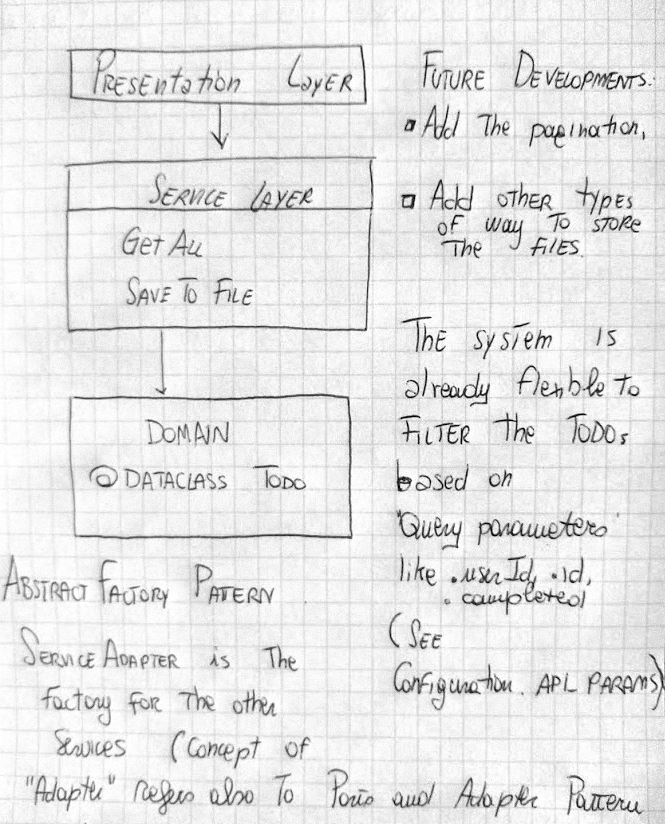

## Process of Development.
Following the Responsibility Driven Design,I've identify a Task that need to be done in the code,
using a high level of Abstraction and promoting Encapsulation: simplify Behaviours and hiding data.
1) Task: to create file according to a JSON file online.

This Application is meant to act like a reminder for the task that have to be done.
The todo-list can download the tasks from the server everyday (as the exercise suggest),
or more than once a day (could be run like a service system, as long as it has a name and a configuration file.)

### Dependency Inversion Principle (DIP)
High level modules should not depends on low levels. Both should depends on abstractions.
Abstractions should not depend on details.

The high-level modules of a software system are the functions classes and packages
that deal with real world concepts.

In THIS CASE the real-world concepts are:
- TODO List
- File
- Storage

The Business code should't depend on technical details but use Abstractions, so we must 
design the architecture in order to not depends on the external services or details we are using, 
in this case the Api.

## The domain model
Building an Architecture to Support Domain Modeling: Behaviours should come first, 
and then the data, because our customers care about what the system DOES.
The Domain Model is the Business Model, the Domain Model is the problem you are trying to solve.

### Unit testing Domain Models
The name of our unit tests describes the behaviours that we want to see from the system, 
the name we use in the tests mirror the language of our domain experts.

In this Application, the TODO list is a DataClass, and not an entity, 
because whenever we have a business concept that has DATA but no Identity, 
we often chose to represent it using the **Value Object Pattern** 

In this case, in the Json, there is also the Id of the User, 
but this is not an Entity that is taken in consideration in this Application.
(on the contrary we use Entity to describe a domain object that has a long-lived identity)

Like the name suggest, we are talking about a Service.
A service runs and it performs a request. in this case calling out an API.

### Run App:
- install python3 and/or check its version with python3 --version

- install pip for python3 with:

`sudo apt-get install python3-dev python3-venv`
- Create the virtual environment with :

`cd python-app-exercise/`

`python3 -m venv .env`

`source .env/bin/activate`

`pip3 install -r requirements.txt`

### Run Tests

`python3 -m pytest tests/ -v`

### Run the Application:

`python3 main.py`

# Python App Exercise

## Exercise
- Use the ApiService to fetch TODOs from an API and save them into the _storage_ folder
    - TODOs can be accessed from this URL: https://jsonplaceholder.typicode.com/todos/
    - Each TODO should be saved on a single file in CSV format
    - The filename must contain the TODO "id" prefixed with the current date.
        - Example: 2021_04_28_123.csv

- https://jsonplaceholder.typicode.com/todos?completed=false&?_start=9&_limit=45

## Extra points
- Use _requests_ library from [PyPI](https://pypi.org/project/requests/)

----
An image of high level architecture

   